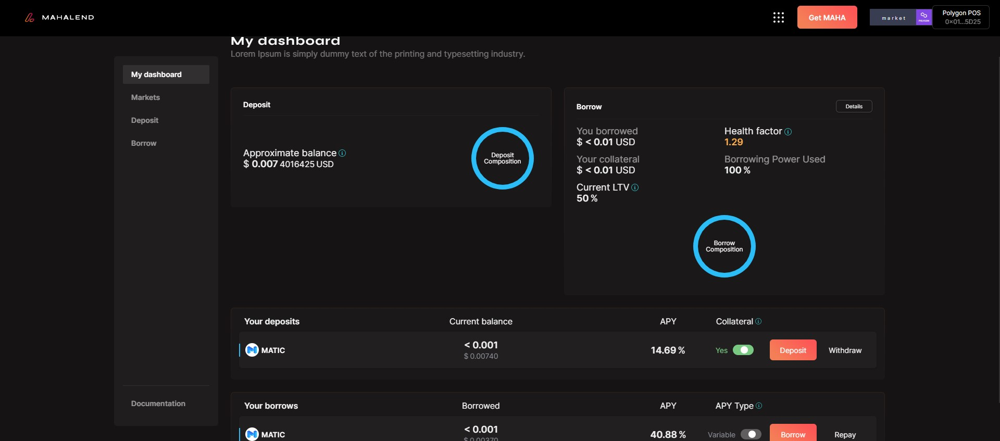

# Understanding the Dashboard

The dashboard gives you the exact details about all the amount borrowed and deposited.&#x20;

You will get to know about the approximate balance left and the collateral and interest rate on the deposits and borrowed amounts.&#x20;

<figure><figcaption>
The dashboard gives you the details about all the amounts that have been made till date.
</figcaption></figure>

