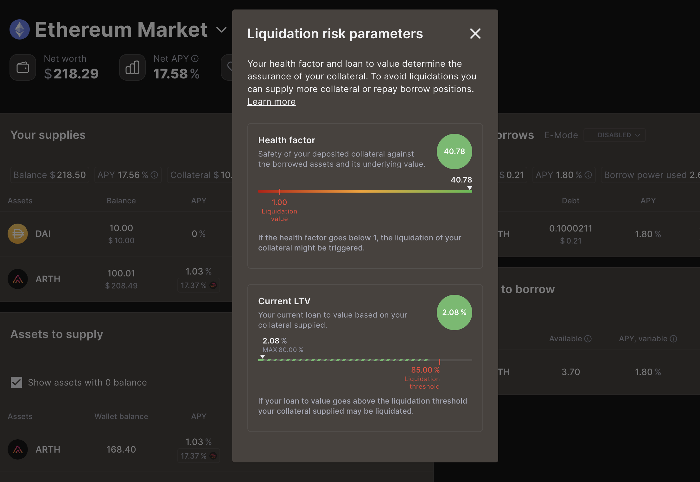

# Welcome to MahaLend

<figure><figcaption></figcaption></figure>

MahaLend is a decentralized non-custodial liquidity protocol (meaning your funds are yours and yours alone) where users can either provide liquidity and receive interest, or borrow liquidity, and pay interest on their loan.&#x20;

In the traditional world, the most common comparable to this type of transaction is a loan from the bank. Here’s an example:

1. You go to the bank for a loan of $15k
2. The bank agrees to give you $15k, however you must pay an interest rate of 10% on this loan.
3. To ensure you don’t take the money and run, you must also put up your brand new Mercedes as collateral(in the event you don’t pay back the loan, they now have ownership of your car)
4. You agree, take out the loan, and now at the maturity of your loan have to pay back the bank $15k + 10%.

The bank acts as the liquidity provider, while you are the liquidity borrower.&#x20;

But what if you don’t want to or can’t go through a bank for this kind of transaction? This could be for any number of reasons including bad credit, third party risk, or your location in the world. That’s where MahaLend comes in.

MahaLend offers anonymous lending and borrowing services to anyone in the world, regardless of location, credit, or circumstance by removing the middle man. All through crypto.&#x20;

Where MahaLend differentiates itself from other liquidity protocols is we take a risk off approach, only allowing lending and borrowing to be done with the worlds first Valuecoin [ARTH](https://docs.arth.loans). This allows for safe borrowing by essentially eliminating your collaterals volatility and liquidation risk. More on that below.&#x20;

MahaLend is a decentralized non-custodial liquidity protocol(meaning your funds are yours and yours alone) where users can either provide liquidity and receive interest, or borrow liquidity, and pay interest on their loan. In the traditional world, the most common comparable to this type of transaction is a loan from the bank. Here’s an example:

1. You go to the bank for a loan of $15k
2. The bank agrees to give you $15k, however you must pay an interest rate of 10% on this loan.
3. To ensure you don’t take the money and run, you must also put up your brand new Mercedes as collateral(in the event you don’t pay back the loan, they now have ownership of your car)
4. You agree, take out the loan, and now at the maturity of your loan have to pay back the bank $15k + 10%.&#x20;

The bank acts as the liquidity provider while you are the liquidity borrower.&#x20;

But what if you don’t want to or can’t go through a bank for this kind of transaction? This could be for any number of reasons including bad credit, third party risk, or your location in the world. That’s where MahaLend comes in.

MahaLend offers anonymous lending and borrowing services to anyone in the world, regardless of location, credit, or circumstance by removing the middle man. All through crypto.&#x20;

Where MahaLend differentiates itself from other liquidity protocols is we take a risk off approach, only allowing lending and borrowing to be done with the worlds first Valuecoin - [ARTH](https://docs.arth.loans). This allows for safe borrowing by essentially eliminating your collaterals volatility and liquidation risk. More on that next.&#x20;
