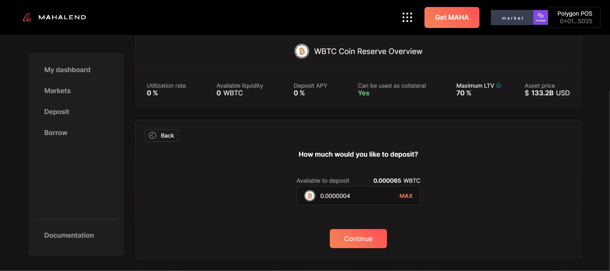
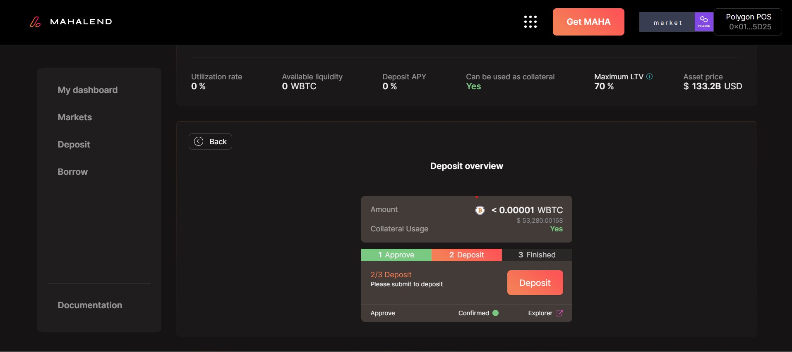

# Deposit

### How does borrowing and lending work?

Users who want to become lenders can deposit their coins into our protocol-based smart contracts. In return they will get newly minted tokens native to the protocol . These tokens represent principal and interest in token form that can be redeemed at any time. The rate of exchange between the native tokens and the tokens deposited embeds inside the APY (annual percentage yield) i.e. an interest rate determined by the ratio that exists between the supplied and borrowed tokens in a particular market.

### How to deposit?

Step 1: If you want to deposit you need to navigate to the deposit section on the page.&#x20;

<figure><figcaption>
The dashboard gives you all the details regarding all deposits and borrowed amount. 
</figcaption></figure>

Step 2: Here you will see different assets that have been listed and select which of them you want \
to deposit into.&#x20;

<figure><figcaption>
In the deposit section you can select an asset from any of them and deposit an amount into it. 
</figcaption></figure>

Step 3: Once you have selected an asset you will be directed to the next page wherein all the details regarding that asset will be given as an overview such as the liquidity rate, deposit APY.&#x20;

Step 4: You need to input an amount and click on 'continue'.&#x20;

<figure><figcaption>
You need to input an amount you want to deposit into it and click on 'continue'. 
</figcaption></figure>

Step 5: Once you have clicked on continue ; you will get a wallet update approval regarding the transaction wherein you will need to click on 'approve'.

<figure><figcaption>
You need to click on 'deposit' to reach the final stage of completion of the deposit process.
</figcaption></figure>

Step 6: Once you confirm the wallet transaction you will need to click on 'deposit'.

Step 7: Once you have received the wallet confirmation regarding the approval of the transaction; approve it and that completes the deposit process.&#x20;
