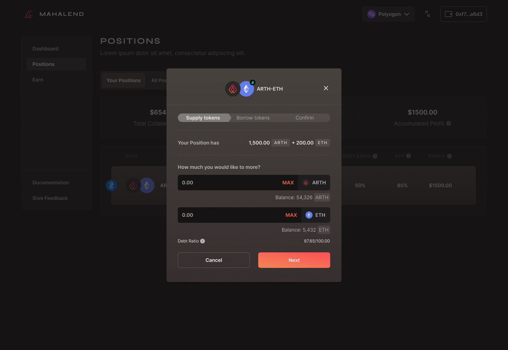
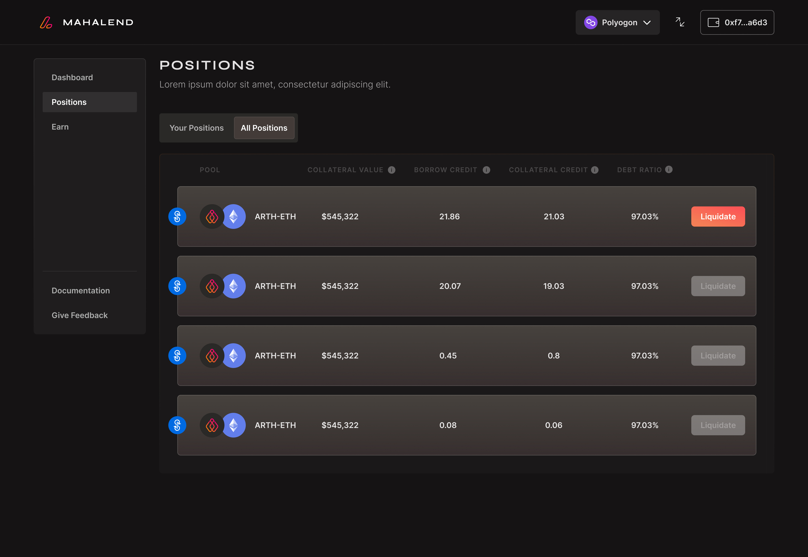
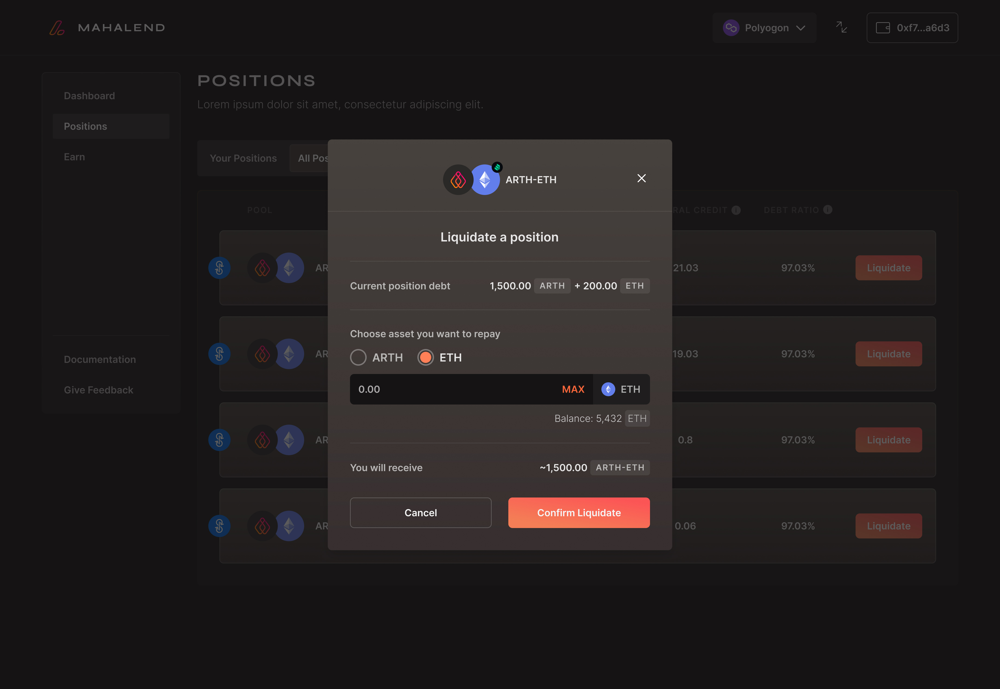

# Managing your Positions

### ADD:&#x20;

This options lets a user add more collateral or debt to their existing position.&#x20;

Step 1: Go to the positions tab and click on the 'your positions' tab.&#x20;

Step 2: Once the user clicks on the ' your positions' tab they can see the pools they have invested in. Here they need to click on the add option to make modifications to their position.&#x20;

Step 3: Once a user clicks on the 'add' option they will get the option to input the amount they want to supply. The user can input the amount they want to supply and click on next.&#x20;

Step 4: The next step directs you to the borrow tokens page where a user can make changes to the leverage they have selected and then click on next.

Step 5: Once the user has clicked on next they will get a final confirmation box that lets the user check the details of all the changes made to the position. Once they have checked all the details; they can click on the confirm button. This will save all the changes made to your position.&#x20;

### REMOVE:

This option lets a user remove a specific amount of liquidity and payback some of the loan.&#x20;

Step 1: Go to the positions tab and click on the 'your positions' tab.&#x20;

Step 2: Once the user clicks on the ' your positions' tab they can see the pools they have invested in. Here they need to click on the 'remove' option to make modifications to their position.&#x20;

Step 3: For using the remove option the user needs to click on 'remove'.

Step 4: After following through step 3; the user will be prompted to select how much liquidity they want to remove. Once the user has selected the specific amount; they need to click on next.&#x20;

Step 5: Once they click on next they will be directed to a page that will let them input a specific amount that they want to pay back.&#x20;

Step 6: Once the user has selected a specific amount that they want to payback they need to click on next. Here the user gets a summary confirmation box that lets them know about the changes made; after which they can click on confirm and close the changes made.&#x20;

### HARVEST:&#x20;

This option lets a user claim a specific amount of tokens from the amount that they have earned.&#x20;

Step 1: Go to the positions tab and click on the 'your positions' tab.&#x20;

Step 2: Once the user clicks on the ' your positions' tab they can see the pools they have invested in. Here they need to click on the 'harvest' option to make modifications to their position.&#x20;

Step 3: Click on harvest; on doing so the user will be prompted to enter a specific amount for the number of token they want to claim from the amount they have earned till date.&#x20;

### LIQUIDATE:

So the need to liquidate is applicable only when the debt ratio crosses a 100 percent. This option is available in the 'All positions' tab.

Step 1: Go to the positions tab and click on the 'all positions' tab.&#x20;

Step 2: Once the user clicks on the ' all positions' tab they can see the pools other users have invested in. Here they need to click on the liquidate option.&#x20;

NOTE: Make sure to check the debt ratio for the specific pool.

&#x20;

Step 3: Once the user clicks on liquidate; they need to select a specific asset they want to repay.  After selecting the asset the user wants to repay; they need to input an amount that they want to liquidate.&#x20;

Step 4: Once the user has filled in all the details they need to click on the confirm the liquidate option to confirm the change and complete the transaction.&#x20;

