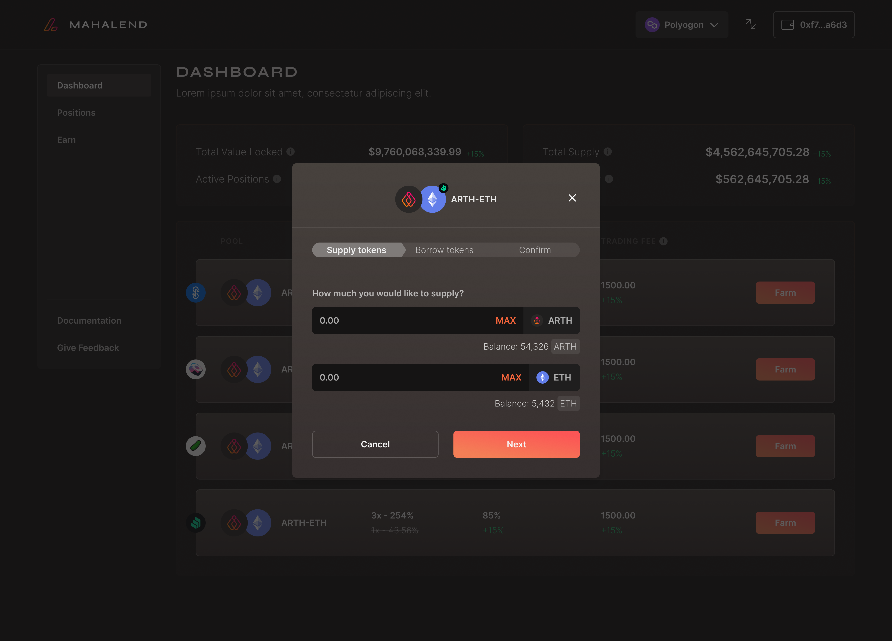

# Opening a Leveraged Position

The dashboard gives you all the details about the pools available and in which ones the user can carry out leveraged farming.&#x20;

Step 1: The first step to do farming is to select the specific pool in which the user wants to supply tokens. The pool details are available on the dashboard where the farm button is highlighted in orange besides each pool.

.png>)

Step 2: Once you have clicked on the 'Farm' button the user will be directed to a pop-up wherein the user gets to input values to supply tokens into the specific pool.&#x20;

Step 3: Once the user has inputted the values to supply tokens into the pool; the user needs to click on next.&#x20;

Step 4: Once the user clicks on next they will be directed to the next part of the process i.e., borrow tokens.

.jpg>)

Step 5: In the borrow tokens section the user can select the leverage they need.&#x20;

**NOTE: The user has to select the leverage in such a way that the debt ratio is always equal to or more than 100.**&#x20;

Step 6: Once the user has selected the leverage they need and check whether the debt ratio is more or equal to 100; the user needs to click on next. After which they are directed to the final confirmation box where in all the details regarding the supply are given.&#x20;

.jpg>)

Step 7: Once the user checks the details and clicks on 'confirm'  the supply process is over and they can check their position in the 'Positions' tab under 'Your positions'.&#x20;
