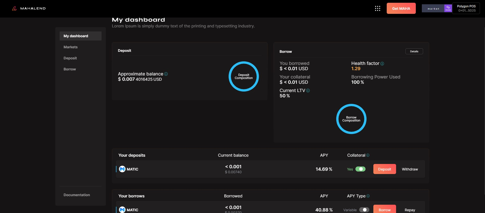

# Understanding the Dashboard

The dashboard gives you all the details regarding your Mahalend account. This includes details on your deposits, and the funds you've borrowed.&#x20;

As you'll see below, your dashboard is your one-stop shop to keep up with your borrowing and lending.&#x20;

You can see your [borrowing or lending APY](../risks/liquidity-risk/interest-rate-model.md) of the markets you participate in, your total collateral, your [health factor](../risk/risk-framework.md), and even your total borrowing power.&#x20;

This is a great tool to ensure you are getting the most out of Mahalend, and that you are maintaining safe collateral levels.

<figure><figcaption>
The dashboard gives you the details about all the amounts that have been made till date.
</figcaption></figure>

