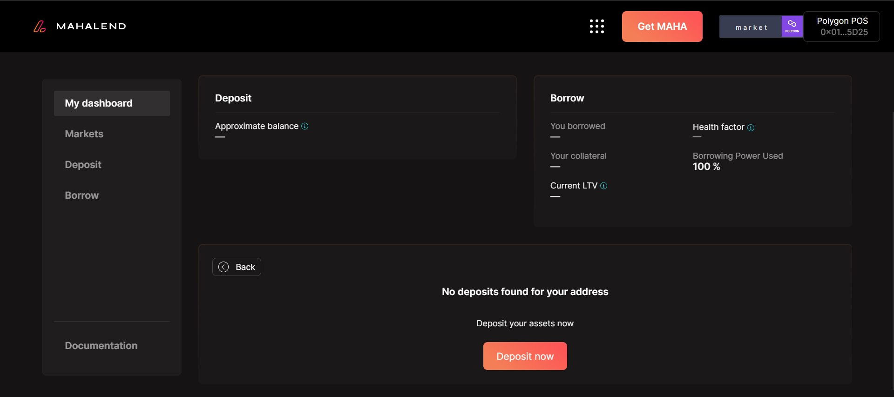

# Borrow ARTH

## Overcollateralized borrowing

### **Step-by-step instructions below👇:**

**Note:** For a user to be able to borrow, they must make a deposit first.

**Step 1**: Connect your wallet to the Mahalend Application. Ensure you are connected to the Ethereum network.&#x20;

**Step 2:** Deposit collateral.

**Note:** Once you make a deposit you will be only be able to borrow ARTH.&#x20;

<figure><figcaption>
You can only borrow currently from ARTH under the Ethereum network.
</figcaption></figure>

**Step 3:** Click on the 'borrow' button and enter the amount you want to borrow. The max borrowable amount will be based on your collateral.

**NOTE:** Make sure to keep an eye on your health factor.  The details regarding the health factor will be displayed according to the amount you enter.&#x20;

**NOTE:** There are two borrow APY's you can choose from while borrowing ARTH:\
_**Variable APY**_- Variable rate can increase and decrease depending on the amount of liquidity in the reserve. \
_**Stable APY**_- It will stay the same for the duration of your loan.&#x20;

<figure><figcaption>
When you input an amount you need to check the health factor alongside the type of borrow APY you want to select. 
</figcaption></figure>

****

**Step 4:** You need to check the details and click on borrow followed by which you will get a wallet approval request to confirm the transaction.&#x20;

**Step 5:** Once you have approved the transaction and get an update regarding the completion you can add the mToken to your wallet to track your supply balance.&#x20;

<figure><figcaption>
You can add the mtoken to your wallet to track the supply balance. 
</figcaption></figure>
